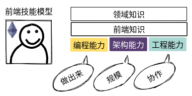

<h3 align="center">
  
</h3>

<h4 align="center">总结</h4>

---

```bash
# 前端程序员的自我修养
优秀=能力+潜力
成就:业务型|技术型
```



### 方法

- `整理法` [组合, 顺序, 维度, 分类]

- `追溯法` [源头, 标准和文档, 大师]

### roadmap

<details>
  <summary>1. 🛹 algorithm</summary>

- path finding
- ll
- kmp
- wildcard

</details>

<details>
  <summary>2. 🟡 javascript</summary>

- ❤️

</details>

<details>
  <summary>3. 🌐 browser</summary>

- mealy state machine
- http
- html parse
- css compute

</details>

<details>
  <summary>4. 🔵 css</summary>

- rule
- layout

</details>

<details>
  <summary>5. 🔴 html</summary>

- tag
- dom api

</details>

<details>
  <summary>6. 📦 componentization</summary>

- lib

</details>

<details>
  <summary>7. 🧰 toolchain</summary>

- yeoman
- webpack
- babel
- unit test

</details>

<details>
  <summary>8. 🚀 publish</summary>

- publish system
- git hooks
- eslint
- headless chrome

</details>
