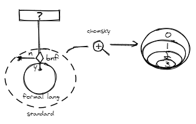

## 语言

> 是一类复合交流系统, 某一门语言则是这类系统的具体例子. 以`Rousseau`为代表的一些思想家认为语言源自情绪, 而`Kant`认为其源于理性和逻辑的思辨.

- 形式语言(文法和语义)

> 是用精确的数学或机器可处理的公式定义的语言, 是一个特定的`alphabet`上的某些有限长字符串的集合. 不像自然语言, 一个形式语言作为一个集合, 需要有某种明确的标准来定义一个字符串是否是它的元素.

- 一些标准
  - `枚举` 有限元素的情况下, 枚举各个字符串
  - `形式文法` [乔姆斯基谱系](#chomsky-hierarchy)
  - `正则表达式` 语法区别于编程语言中的正则表达式
  - `自动机` 图灵机

## Chomsky hierarchy

> 是计算机科学中刻画形式文法(字符串的一套[产生式](#BNFBackus-Naur-Form)规则)表达能力的一个分类谱系.


| Grammar | Languages | Automaton |
| - | - | - |
| Type-0 | recursively enumerable | Turing machine |
| Type-1 | context-sensitive | Linear-bounded non-deterministic Turing machine |
| Type-2 | context-free | Non-deterministic pushdown automaton |
| Type-3 | regular | Finite state automaton |

> 上下文无关语言为大多数程序设计语言的语法提供了理论基础

## BNF(Backus-Naur Form)

> 是推导规则(产生式)的集合, 写为`<符号> ::= <使用符号的表达式>`这里的 <符号> 是`非终结符`, 而表达式由一个符号序列, 或用`|`分隔的多个符号序列构成, 每个符号序列整体都是左端的符号的一种可能的替代. 从未在左端出现的符号叫做`终结符`.

- 例子

```
<letter> ::= 'a' | 'b' | ...
<word> ::= <letter> | <letter><word>
<phrase> ::= <word> | <word>' '<phrase>
```

`::=` 定义

`|` 或

`<word>` 以及 `<phrase>` 用到了递归

- ecma

[docs](https://www.ecma-international.org/ecma-262/8.0/index.html#sec-grammar-summary)

- 小总结



一套产生式可以用来区分字符串是否属于某个形式语言集合. 乔姆斯基谱系对产生式表达能力进行了分类.

## 形式语言的分类

- 按用途划分
1. `数据描述语言` html css
1. `编程语言` javascript

- 按表达方式
1. `命令式语言` 关注过程 js(oop)
1. `声明式语言` 关注结果 js(fp)

### 图灵完备性

 

> 具备图灵完备性的语言可以描述所有可计算的问题

实现方式
- 命令式(图灵机) if while
- 声明式(lambda演算) recursion

### 动态与静态

- 动态 runtime 运行时改变程序结构

- 静态 compiletime

### 类型系统

- 静态类型 编译阶段确定所有变量的类型

- 动态类型(相较之下时间和空间上都有性能损耗) 执行阶段确定所有变量的类型

- 强类型 不允许改变变量类型(除非进行强制类型转换)

- 弱类型 变量可以被赋予不同的类型

- 泛型 不预先确定的数据类型, 在使用的时候传入具体的类型参数

- 协变与逆变 子类型更加具体, 父类型更宽泛. 所以子类型可以赋值给父类型, 与集合中的父子概念相悖. `ts`中参数类型默认是双向协变的.

## 命令式语言一般设计方式

1. [Atom](#Atom) `0`
1. Expression `i += 1;`
1. Statement `while(i < 6) ++i` <- 图灵完备
1. Structure `function`
1. Program `module`

### Atom

grammar
- literal 
- variable
- keywords
- whitespace
- line terminator

runtime
- types
- execution context

`Number`


`String`

- 字符
- 码点
- 编码方式