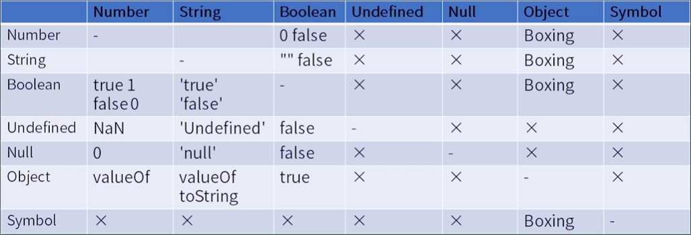

## grammar

tree vs priority

expressions h -> l

> member

- a.b get `reference`(标准中的类型, 不是语言中的类型)

- a[b]

- f\`s` s: string -> Array(s)

```javascript
const log = (val) => console.log(val);

log`🐇`; // ["🐇"]
```

- super.b

- super['b']

- new.target

- new F()

> new

- new F

> reference

- object

- key: string | symbol

javascipt 在运行时用引用类型来处理写相关的操作(delete, assign)

> call

- f()

- super()

- f()['b'] m -> c 优先级降低

- f().b

- f()`s`

语法结构(产生式)所能表达的内容多于运算符优先级

> left handside vs right handside

依据表达式能否放左边, left 也是 right

> update

- a++, a--

- ++a, --a

> unary

- delete a.b

- void f() 类似空格和回车, 起到改变语法结构的作用

- typeof a

- +a

- -a

- ~a

- !a

- await a

> exponental

- \*\* 右结合

> multiplicative

- \* / %

> additive

- \+ -

> shift

- << >> >>>

> relationship

- < > <= >= instanceof in

> equality

- == 类型不同时优先把 boolean 类型的变量转换成 number 类型

- !=

- ===

- !==

> bitwise

- & ^ |

> logical

短路原则

- &&

- ||

> conditional

短路原则

- ? :

> type convertion



- a + b string, number

- 'false' == false // false

- a[o] = 1

> unboxing

拆箱转换 object -> primitive values

- to primitive

- toString and valueOf string, number

- Symbol.toPrimitive

> boxing

装箱转换 primitive values -> object

- new Number(1)

- new String('a')

- new Boolean(true)

- new Object(Symbol('a'))

## runtime

- completion record

描述语句执行结果的数据结构

`[[type]]` normal, break, continue, return, throw

`[[value]]` basic types

`[[target]]` label

- 简单语句

不再容纳其他语句

1. expression 因为有`=`的存在, 所以有一定的副作用
1. empty 单独的`;`
1. debugger `debugger;` break point
1. throw
1. continue 跳过当次循环
1. break 跳出整个循环 [label]
1. return

- 复合语句

控制简单语句的执行顺序

1. block `{}` normal
1. if
1. switch
1. iteration 循环
1. with 通过`with`打开一个对象, 把对象所有属性放到作用域里, 节约空间
1. labelled 在简单或者复合语句前加上 label
1. try try(不是 block) catch finally(return 不打断执行) `{}`不能省略

- 声明

对后续的语句产生作用(与 javascript 划分并不一致)

只看 function body, 提升

1. function
1. generator function\*
1. async function
1. async generator
1. variable statement var 既有声明的作用, 又用有计算的能力

有预处理但是提前调用会报错, 没有提升

1. class
1. lexical const let

- 预处理(pre-process)

在一段代码执行之前, 引擎会对代码本身做预先处理, 所有的声明都有预处理机制, 但是新声明会报错

- 作用域

早期都是作用在所属函数体, const 和 let 是作用于所在`{}`内, 块级作用域, 在循环语句中(for 中单独的一块作用域)作用于整个循环语句

- 结构化

js 的执行粒度(运行时)

1. 宏任务 jsc 的说法 传给引擎的任务 macrotask
1. 微任务(只有 promise) 引擎内部执行的任务 microtask(job)
1. 函数调用(execution context)
1. 语句和声明(completion record)
1. 表达式(reference)
1. 直接量和变量以及 this 等等

> 事件循环 event loop

来自 node 里的概念, 是如何去使用引擎的过程,

1. get code
1. execute
1. wait 等待一个时间或者是事件 🔒 在独立的线程里执行

> 函数调用

栈式调用关系

1. code evaluation state 用于 async 和 generator 函数, 保存代码执行到哪的信息
1. function 初始化 function
1. script or module
1. generator generator 函数每次执行所生成的 generator
1. realm 保存所有使用的内置对象
1. lexical environment 保存变量 this new.target super
1. variable environment 仅处理 var 声明

- environment records

  - declarative
    - function
    - module
  - global
  - object

- closure 每个函数都会生成一个闭包

  - environment record(箭头函数会保留 this)
  - code

- realm

  在一个引擎实例里所有的内置对象会放到一个 realm 里, 在不同的 realm 实例之间, 他们完全互相独立(instanceof 可能会失效), 函数表达式和对象直接量均会创建对象, 使用`.`做隐式转换也会创建对象, 这些对象也是有原型的, 如果没有 realm, 就不知道他们的原型是什么

## 小总结

个人拙见
