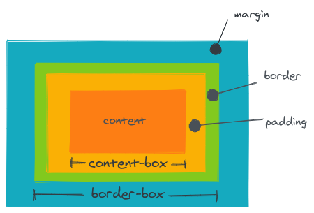
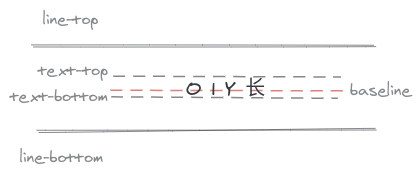

# css 排版

## 盒(box)

- html 代码中可以书写 开始标签, 结束标签和自封闭标签
- 一对起止标签, 表示一个元素(语义上的)
- dom 树中存储的是元素和其他类型的节点(文本, 注释, cdata, processing-instruction, dtd...)
- css 选择器选中的是元素(或者伪元素)
- css 选择器选中的元素, 在排版时可能产生多个盒
- 排版和渲染的基本单位是盒

## 正常流(和一般书写方式类似)

> v1 基于正常流 -> v2 flex -> v3 grid -> v3.5 houdini

- 排版(文字和盒)
  - 收集盒和文字进行
  - 计算盒和文字在行中的排布
  - 计算行与行的排布

> [BFC [IFC [inline, text], block]]

- 行级排布

  - baseline(基准线对齐)
  - text(码点)

- 块级排布
  - float 和 clear
  - margin collapse(BFC)

1. 盒模型

> 📦

2. 行模型

3. BFC 合并(block box && overflow: visible)

- block box(里外都有 BFC)
  - block container(里面有 BFC)
    - 能容纳正常流的盒, 里面就有 BFC
  - block-level box(外面有 BFC)

* block container(所有容纳里面不是 display 模式的 -> 里面默认是正常流)

  - block
  - inline-block
  - table-cell
  - flex item
  - grid cell
  - table-caption

* block-level box

  - block-level
  - inline-level
  - `display: run-in`

* establish BFC

  - floats 里面
  - absolutely positioned elements 里面
  - block containers that are not block boxes
  - block boxes with `overflow` other than `visible`

## flex 排版(没有文字)

- 收集盒进行
- 计算盒在主轴方向的排布
- 计算盒在交叉轴方向的排布

1. 分行

- 根据主轴的尺寸把元素分进行
- 若设置了 no-wrap, 则强行分配进第一行

2. 计算主轴方向

- 找出所有的 flex 元素
- 把主轴方向的剩余尺寸按比例分配给这些元素
- 若剩余空间为负数, 所有 flex 元素为 0, 等比压缩剩余元素

3. 计算交叉轴方向

- 根据每一行中最大元素尺寸计算行高
- 根据行高 flex-align 和 item-align, 确定元素具体位置

# 动画与绘制

- 动画

  - @keyframes
    - percentage
    - from, to
  - animation
    - (name, duration, timing-function, delay, iteration-count, direction)

- transition

  - (property, duration, timing-function, delay)
  - timing-function 三次贝塞尔曲线

- 颜色

  - cmyk 与 rgb
  - hsl 与 hsv -> hue 色相, saturation 纯度(杂色), 亮度/明度 <- 语义化的颜色

- 绘制
  - 几何图形
    - border
    - box-shadow
    - border-radius
  - 文字
    - font
    - text-decoration
  - 位图
    - background-image
  - 应用技巧
    - data uri + svg
