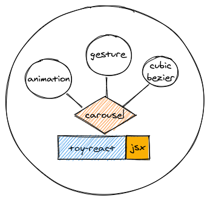

# Componentization

```md
# why componentization?

* reusability
* separation of concerns

# how to componentize?

* container/presentation model
* composition vs inheritance (fp vs oop)

| container      | presentation     |
| -------------- | ---------------- |
| smart          | dump             |
| A/B            | presentation     |
| api call       | ui centric       |
| data transform | user interaction |
```

> from ReactFoo 2017, Abraar Syed

* `wikipedia` Component-based software engineering (CBSE), also called components-based development (CBD), is a branch of software engineering that emphasizes the separation of concerns with respect to the wide-ranging functionality available throughout a given software system.

* `baidu` 组件化是指解耦复杂系统时将多个功能模块拆分、重组的过程，有多种属性、状态反映其内部特性。

# 课程中的组件化实践



```md
> lib -> componentization library (...jsx)

# dependencies

* animation -o- 🐈 [anime.js]
* gesture (touch and move) -o- 🐈 [zingtouch]
* cubic bezier (use javascript)
```
